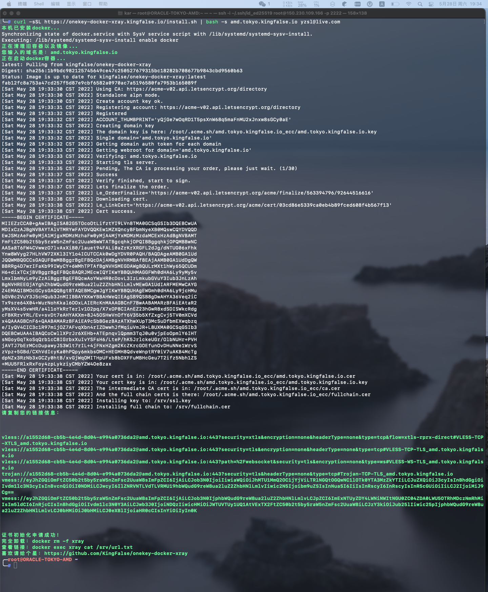

# onekey-docker-xray

**一键部署你的Xray服务,一次6个配置，哪个舒服用哪个，将输出链接全部复制粘贴到v2rayNG、Trojan等APP中从剪切板添加节点即可**

1. VLESS over TCP with XTLS，数倍性能，首选方式
2. VLESS over TCP with TLS
3. VLESS over WS with TLS
4. VMess over TCP with TLS
5. VMess over WS with TLS
6. Trojan over TCP with TLS

### 快速安装

* 确保你的域名已经解析到该服务器!!!

* 安装：`curl -sSL https://raw.githubusercontent.com/KingFalse/onekey-docker-xray/main/install.sh | bash -s 你的域名 你的邮箱`

* 手动docker安装：`docker run --name xray -d --restart=always --pull=always -p 443:443 -e DOMAIN=你的域名 -e EMAIL=你的邮箱 kingfalse/onekey-docker-xray`

### 查看链接

```
docker exec xray cat /srv/url.txt
```

### 完全卸载

```
docker rm -f xray
```

### 屏幕预览



### 其他

有问题提Issues,有需求也可
